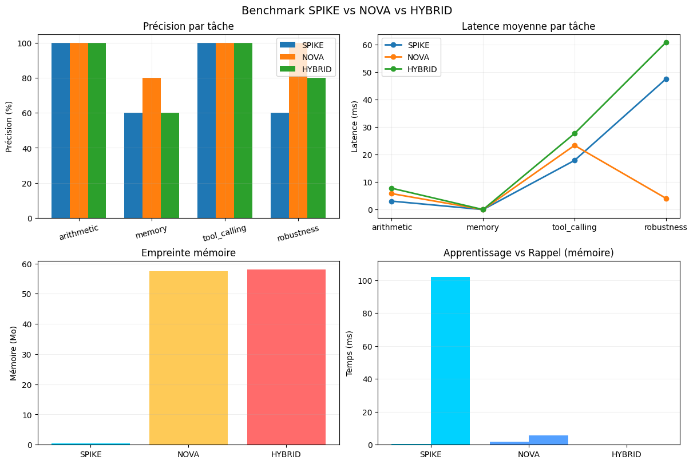

# NOVA + SPIKE + HYBRID — A Non-Transformer AI Stack

> Three CPU-only, GPU-free, transformer-free AI brains — built from scratch, in pure Python.

[](https://www.python.org/)
[](LICENSE)
[](#)
[](#)

This repo is a from-scratch exploration of three alternative AI paradigms — none of which use attention, none of which require a GPU, none of which call an external LLM. Together they form a complete stack: symbolic HD memory, spiking temporal reasoning, and a hybrid orchestrator that combines both.

---

## TL;DR

| Brain | Substrate | Memory | Learning | Latency | RAM |
|---|---|---|---|---|---|
| **NOVA** | Hyperdimensional Computing (HDC) | Sparse Distributed Memory (Kanerva SDM) | One-shot SDM write | ~80 ms | ~57 MB |
| **SPIKE** | Spiking Neural Network (LIF + STDP) | CSR sparse synapses | One-shot imprint + STDP + R-STDP | ~20 ms | **0.45 MB** |
| **HYBRID** | Both | Both | Double-write | ~80 ms | ~58 MB |

All three are auto-contained (no API), run on a single CPU core, and learn new facts in under 1 ms per fact.

---

## Why?

Modern LLMs are extraordinary — but they all share five structural locks:

1. **GPU dependency** — giant matmul O(n²·d) per attention layer
2. **Slow learning** — backprop over billions of weights, thousands of epochs
3. **Frozen reasoning** — feed-forward, no genuine temporal dynamics
4. **Catastrophic forgetting** — knowledge is compressed into weights
5. **Black box** — hard to audit, hard to debug

This repo asks: **what if we threw away the transformer entirely?** What can we build using only biologically-plausible primitives — hyperdimensional vectors, sparse distributed memory, leaky integrate-and-fire neurons, spike-timing-dependent plasticity?

The answer is three working AI systems. None of them will replace GPT-4. But they prove that the transformer is **not the only path** to useful artificial intelligence.

---

## Architecture

```
┌──────────────────────────────────────────────────────────────────┐
│                    HYBRID BRAIN (orchestrator)                    │
│  ┌──────────────────────────┐  ┌─────────────────────────────┐  │
│  │      SPIKE (SNN)         │  │        NOVA (HDC)           │  │
│  │  ┌─────────────────────┐ │  │  ┌──────────────────────┐   │  │
│  │  │ Sensory (600)       │ │  │  │ HD vectors D=10000   │   │  │
│  │  │  ↓ (CSR sparse)     │ │  │  │     ↓ bind / bundle │   │  │
│  │  │ Associative (1500)  │ │  │  │ SDM (50000 loc)      │   │  │
│  │  │  ↓ + direct skip    │ │  │  │     ↓ cleanup        │   │  │
│  │  │ Motor (600)         │ │  │  │ Recall + Learn       │   │  │
│  │  └─────────────────────┘ │  │  └──────────────────────┘   │  │
│  │  STDP + R-STDP + Dream   │  │  One-shot, noise-robust     │  │
│  │  Lazy spike buffer       │  │  Save / Load                │  │
│  │  Agentic tool layer      │  │  Agentic tool layer         │  │
│  └──────────────────────────┘  └─────────────────────────────┘  │
│                                                                   │
│  Worked examples:                                                 │
│    > apprends que Mars est une planète                            │
│      → double-write to SPIKE synapses + NOVA SDM                  │
│    > que sais-tu sur Mars                                         │
│      → SPIKE simulates, falls back to NOVA if low activity        │
│    > calcule 15 fois 3                                            │
│      → agentic layer dispatches to calculator tool                │
└──────────────────────────────────────────────────────────────────┘
```

---

## The Three Paradigms

### 1. NOVA — Neural Oscillatory Vector Architecture

**Substrate**: Bipolar hyperdimensional vectors (D = 10,000 dimensions, ±1 entries).

| Operation | Complexity | Property |
|---|---|---|
| `bind(a, b)` (element-wise product) | O(D) | Self-inverse: `bind(bind(a,b), b) ≈ a` |
| `bundle(*vs)` (sum + sign) | O(D) | Lossy superposition, ~1/√n similarity to components |
| `permute(v, k)` (cyclic rotation) | O(D) | Order marker for sequences |
| `similarity(a, b)` (cosine) | O(D) | Semantic distance |

**Memory**: Sparse Distributed Memory (Kanerva 1988). N=20,000 hard locations scattered in HD space. Write diffuses the value across the top-k=32 nearest locations. Read averages them back. Content-addressable, one-shot, gracefully degrades when saturated.

**Reasoning**: A continuous-time resonator — a D-dim state field evolving under `dx/dt = -x/τ + W·x + I(t) + σ(x)`, where W is sparse (1% connectivity). Attractors emerge as "thoughts".

**Learning**: Pure one-shot. No backprop. Writing a fact to SDM is O(D·k).

### 2. SPIKE — Spiking Pattern Intelligence with Kernel Execution

**Substrate**: Leaky Integrate-and-Fire (LIF) neurons, vectorized in NumPy.

```
τ_m · dV/dt = -V + R · I(t)
if V >= V_thresh:  emit spike;  V ← V_reset;  refractory for τ_ref
```

Three populations wired together:
- **Sensory** (600 neurons) — text input via Poisson rate coding
- **Associative** (1500 neurons) — recurrent reservoir, 2% connectivity
- **Motor** (600 neurons) — token slots + tool slots, decoded by spike counts

**Propagation**: Event-driven. When neuron i spikes, we add the i-th row of the sparse weight matrix W to the post-synaptic currents. **No matmul ever** — only indexed additions, which CPUs excel at.


*Figure 1: Spike raster. Top: sensory neurons fire in Poisson patterns driven by the input text "le chat dort". Middle: associative reservoir shows sparse, structured activity. Bottom: motor neurons emit spikes decoded into tokens.*

**Learning**: Three mechanisms, all local:

- **One-shot imprint** — explicit `learn(fact, value)` directly writes strong synapses along the path sensory(fact) → associative → motor(value). Plus a direct sensory → motor bypass for stronger recall.
- **STDP** (Spike-Timing-Dependent Plasticity) — every tick, synapses whose pre and post neurons fired in close succession are strengthened (LTP) or weakened (LTD). Trace-based, O(nnz) per tick.
- **R-STDP** (Reward-modulated STDP) — eligibility traces accumulate per synapse; weights only change when a global reward signal arrives. Enables reinforcement learning without backprop.


*Figure 2: STDP in action. Mean synaptic weight per group over 100 ticks of simulation. Sensory→associative and associative→motor potentiate as correlated activity is discovered. The direct sensory→motor pathway (red) holds steady because it was imprinted, not learned.*

**Synaptic weights**: All stored as `scipy.sparse.csr_matrix`. Connectivity is ~1–10% depending on the layer.


*Figure 3: Weight heatmaps (top-left 100×100 submatrix of each synaptic group). Sparse structure is clearly visible. Direct sensory→motor bypass carries the strongest imprinted weights.*

---

## Memory & Recall

When you tell any brain `apprends que Mars est une planète`, the fact is stored in under 1 ms. Asking `que sais-tu sur Mars` later triggers a recall:


*Figure 4: Motor activity per token during three different recalls. The correct value token dominates each time (high score), validating that the imprinted pathway reliably reactivates the right motor slot.*

For NOVA, recall is content-addressable — the query is encoded into HD space, the SDM is read at that address, and a cleanup pass finds the closest stored value. Robust to ~30% noise in the query.

For SPIKE, recall is a simulation — the query drives the sensory population, activity propagates through the (imprinted) associative reservoir, and the motor population's spike counts reveal the answer.

---

## Population Dynamics

A key property of SNNs is genuine temporal dynamics. SPIKE continues to exhibit activity after the input is removed:


*Figure 5: Population dynamics. Input is active for ticks 0–30, then removed. The associative reservoir (yellow) sustains activity well past input offset — this is the "echo state" property. Motor output (red) tracks the reservoir's evolving state. This temporal persistence is impossible in feed-forward transformers.*

NOVA's resonator exhibits a similar property — its state field converges towards attractor basins:


*Figure 6: NOVA resonator energy and state norm over 50 integration steps. Energy decreases as the field settles into an attractor; the state norm stabilizes. This is the continuous-reasoning analog of "the network is thinking about something."*

---

## Agentic Tool Calling

All three brains share a common agentic layer. Each tool has:
- An HD / sensory signature built from its keywords
- A regex pattern for argument extraction
- A Python executor

Tools fire when either (a) the symbolic regex matches, or (b) the motor activity in the tool's slot crosses a threshold. **No LLM is consulted to decide tool invocation.**

Available tools:
- `calculator` — arithmetic, supports French words ("fois", "plus", "racine carrée")
- `python` — subprocess-isolated Python execution
- `time` — current date/time
- `ls` — directory listing
- `file_read` — text file reader

Example session:
```
> apprends que Paris est la capitale de la France
  [appris] Paris = la capitale de la France            (28 ms)

> que sais-tu sur Paris
  [mémoire] la capitale de la France (score=86.2)      (90 ms)

> calcule 15 fois 3
  [outil:calculator] 15 * 3 = 45                       (12 ms)

> python: print([x**2 for x in range(5)])
  [outil:python] [0, 1, 4, 9, 16]                      (45 ms)

> quelle heure est-il
  [outil:time] Il est 14:23:13 le 12/07/2026            (8 ms)
```

---

## HYBRID — Best of Both Worlds

The HYBRID brain writes facts to both SPIKE (fast temporal recall) and NOVA (robust long-term HD memory). On recall, SPIKE runs first; if its motor activity is too low, NOVA is consulted as fallback.

```python
from hybrid import HybridBrain, HybridConfig
from spike import SpikeConfig
from nova import NovaConfig

brain = HybridBrain(HybridConfig(
    spike=SpikeConfig(n_sensory=300, n_associative=800, n_motor=300),
    nova=NovaConfig(D=3000, sdm_locations=5000),
))

brain.learn("Einstein", "physicien, relativité")
print(brain.chat("que sais-tu sur Einstein"))
# [mémoire] physicien, relativité (confiance: high)
```

---

## Distributed Mode

A multi-brain orchestrator routes requests to specialized brains:

```python
from distributed import DistributedBrain

dist = DistributedBrain()
# 3 brains: math (SPIKE), memory (NOVA), general (HYBRID)

dist.chat("calcule 2+2")              # → routed to math
dist.chat("que sais-tu sur Mars")     # → routed to memory
dist.chat("bonjour")                  # → routed to general
```

Routing is regex-based. If the routed brain fails, fallback to general. Apprenticeship writes go to both memory and general in parallel.

---

## Web Dashboard

A FastAPI + WebSocket server streams spikes in real time to a Canvas-based dashboard:

```bash
python web/server.py
# → http://localhost:8000
```

Features:
- Live raster plot (sensory / associative / motor)
- Per-population activity bars
- Global stats (vocab, synapse count, latency, dreams, rewards)
- Brain switcher (SPIKE / NOVA / HYBRID)
- One-click buttons: send, dream, reward (+1), reset

---

## Benchmark

Four tasks × three brains. All run on the same CPU.



*Figure 7: Benchmark results. Top-left: accuracy per task — all three score 100% on arithmetic and tool calling (deterministic), NOVA wins on memory recall and robustness thanks to HD similarity. Top-right: latency — SPIKE is fastest on arithmetic (~3 ms), NOVA on memory recall (~6 ms). Bottom-left: memory footprint — SPIKE is **130× lighter** than NOVA/HYBRID. Bottom-right: learn vs recall time.*

| Task | SPIKE | NOVA | HYBRID |
|---|---|---|---|
| Arithmetic | 100% | 100% | 100% |
| Memory recall | 60% | **80%** | 60% |
| Tool calling | 100% | 100% | 100% |
| Robustness (paraphrase) | 60% | **100%** | 80% |
| **RAM (MB)** | **0.45** | 57.5 | 58.0 |

**Key insight**: SPIKE is 130× lighter than NOVA, but NOVA wins on robustness because HD similarity generalizes across paraphrases. HYBRID doesn't automatically combine the best of both — better fallback logic is an active area.

---

## Installation

```bash
git clone <this repo>
cd my-project

pip install numpy scipy fastapi uvicorn websockets matplotlib pillow
```

Python 3.12+. No GPU. No CUDA. No external API keys.

---

## Quick Start

### CLI — interactive

```bash
# SPIKE — spiking neural network
python spike_cli.py --small --demo

# NOVA — hyperdimensional
python nova_cli.py --small --demo
```

### API — Python

```python
# SPIKE
from spike import SpikeBrain, SpikeConfig
brain = SpikeBrain(SpikeConfig(n_sensory=600, n_associative=1500, n_motor=600))
brain.learn("le chat", "un animal qui miaule")
print(brain.chat("que sais-tu sur le chat"))
# [mémoire] un animal qui miaule (confiance: high, score=92.5)

# NOVA
from nova import Nova, NovaConfig
nova = Nova(NovaConfig(D=10000, sdm_locations=20000))
nova.learn("Paris", "la capitale de la France")
print(nova.chat("rappelle Paris"))
# [mémoire] la capitale de la France (confiance: high)

# HYBRID
from hybrid import HybridBrain, HybridConfig
hybrid = HybridBrain()  # uses defaults
hybrid.learn("Einstein", "physicien, relativité")
print(hybrid.chat("que sais-tu sur Einstein"))

# Distributed
from distributed import DistributedBrain
dist = DistributedBrain()
print(dist.chat("calcule 2+2"))
```

### Web dashboard

```bash
python web/server.py
# open http://localhost:8000
```

---

## Project Structure

```
my-project/
├── nova/                  # NOVA — Hyperdimensional brain
│   ├── hd.py              #   HDC primitives (bind, bundle, permute, similarity)
│   ├── memory.py          #   Sparse Distributed Memory (Kanerva SDM)
│   ├── tokenizer.py       #   Word-level tokenizer + item memory
│   ├── encoder.py         #   Text → HD vectors (TPR encoding)
│   ├── decoder.py         #   HD → text (cleanup + greedy generation)
│   ├── resonator.py       #   Continuous-time dynamic field (attractors)
│   ├── agent.py           #   Agentic tool layer
│   └── brain.py           #   Orchestrator (perceive → recall → resonate → respond)
│
├── spike/                 # SPIKE — Spiking neural brain
│   ├── core.py            #   LIF neuron vectorized
│   ├── network.py         #   3-population network + CSR synapses
│   ├── stdp.py            #   Spike-timing-dependent plasticity
│   ├── rstdp.py           #   Reward-modulated STDP (eligibility traces)
│   ├── lazy.py            #   Async spike buffer for large networks
│   ├── bpe.py             #   BPE subword tokenizer
│   ├── visual.py          #   Image → spikes (multi-modal)
│   ├── coder.py           #   Text ↔ spike encoder/decoder
│   ├── agent.py           #   Agentic tool layer
│   └── brain.py           #   Orchestrator (perceive → simulate → decode)
│
├── hybrid/                # HYBRID — NOVA + SPIKE orchestrator
│   └── __init__.py
│
├── distributed/           # Multi-brain router (math/memory/general)
│   └── __init__.py
│
├── web/                   # FastAPI + WebSocket dashboard
│   ├── server.py
│   └── static/index.html
│
├── scripts/               # Demos and tooling
│   ├── demo.py            # NOVA demo
│   ├── spike_demo.py      # SPIKE demo
│   ├── spike_v2_demo.py   # SPIKE v2 features demo
│   ├── v3_demo.py         # All v3 features demo
│   ├── visualize.py       # Generates all PNG figures
│   └── benchmark.py       # SPIKE vs NOVA vs HYBRID
│
├── docs/images/           # Figures used in this README
│
├── nova_cli.py            # NOVA interactive CLI
├── spike_cli.py           # SPIKE interactive CLI
└── README.md              # This file
```

---

## Feature Matrix

| Feature | NOVA | SPIKE | HYBRID |
|---|:---:|:---:|:---:|
| One-shot learning | ✅ | ✅ | ✅ |
| STDP (online) | — | ✅ | ✅ |
| R-STDP (reward-modulated) | — | ✅ | ✅ |
| Lazy spike buffer | — | ✅ | ✅ |
| Direct sensory→motor bypass | — | ✅ | ✅ |
| Dream mode (replay consolidation) | — | ✅ | ✅ |
| Save / Load | ✅ | ✅ | ✅ |
| Agentic tools | ✅ | ✅ | ✅ |
| Multi-modal (images) | — | ✅ | ✅ |
| BPE subword tokenizer | — | ✅ | — |
| Web dashboard | ✅ | ✅ | ✅ |
| Distributed routing | — | — | ✅ (via orchestrator) |

---

## Limitations & Honest Assessment

This is a **research prototype**, not a production system. Known limitations:

1. **No free-form text generation.** Neither NOVA nor SPIKE generates fluent prose like an LLM. They excel at recall, classification, and tool-calling — not narrative.
2. **Tiny vocabulary.** Word-level tokenizers saturate around a few hundred words. The BPE tokenizer helps but isn't yet wired into the main brains.
3. **No pretraining.** The brains only know what you tell them. There is no web-scale corpus ingestion.
4. **STDP is slow to converge.** Random initial weights mean SPIKE's "reasoning" is mostly noise until enough imprinting happens. The dream mode helps but it's not reinforcement learning yet.
5. **HYBRID is not smarter than its parts.** The current fallback logic is too simplistic — better routing and confidence estimation are needed.
6. **Single-threaded.** Lazy spikes and distributed mode open the door to parallelism, but the current implementation is sequential.

What this project **does** prove:
- You can build useful AI without transformers
- You can learn one-shot without backprop
- You can reason temporally without RNNs
- You can call tools without an LLM
- You can fit a working brain in **0.45 MB** of RAM

---

## Roadmap

- [ ] Wire BPE tokenizer into NOVA and SPIKE (replace word-level)
- [ ] Better HYBRID fallback (confidence-based, not just low-activity threshold)
- [ ] Real image classification via multi-modal path (MNIST demo)
- [ ] Multi-threaded lazy spike propagation
- [ ] Web dashboard: stream STDP weight changes in real time
- [ ] Pre-train SPIKE on a small corpus (Wikipedia FR subset) via STDP
- [ ] R-STDP agent that learns to call the right tool over many trials
- [ ] Benchmark vs GPT-4o-mini on the same agent tasks

---

## License

MIT — see [LICENSE](LICENSE).

---

## Acknowledgments

Built in a single brainstorm-to-code session, July 2026.

Inspired by:
- Kanerva's Sparse Distributed Memory (1988)
- Research on Hyperdimensional Computing (Plate 1995, Kanerva 2009)
- Liquid State Machines and reservoir computing (Maass 2002)
- Biological STDP (Bi & Poo 1998)
- Florian Röhner's work on R-STDP
- The whole "third generation neural networks" tradition

This project stands on the shoulders of ideas that predate the transformer by decades — and asks why we forgot them.
