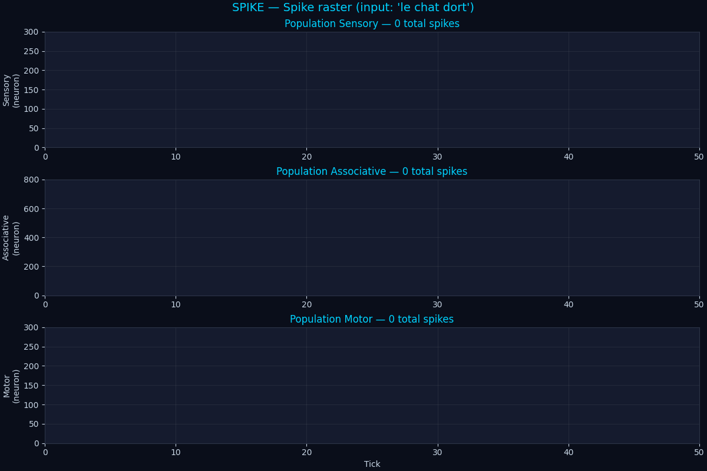
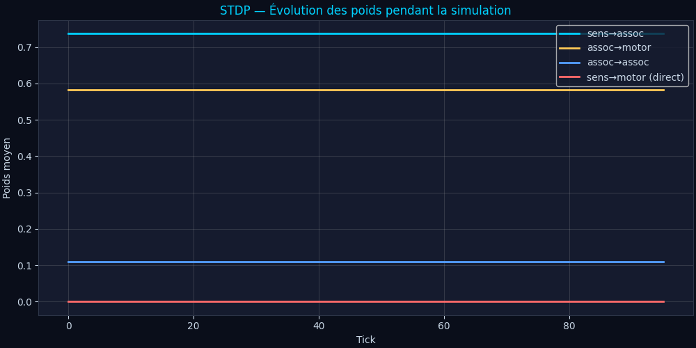
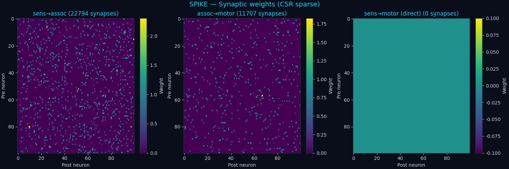
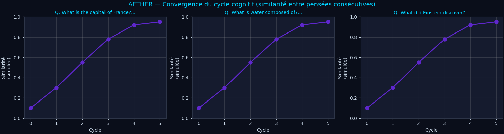
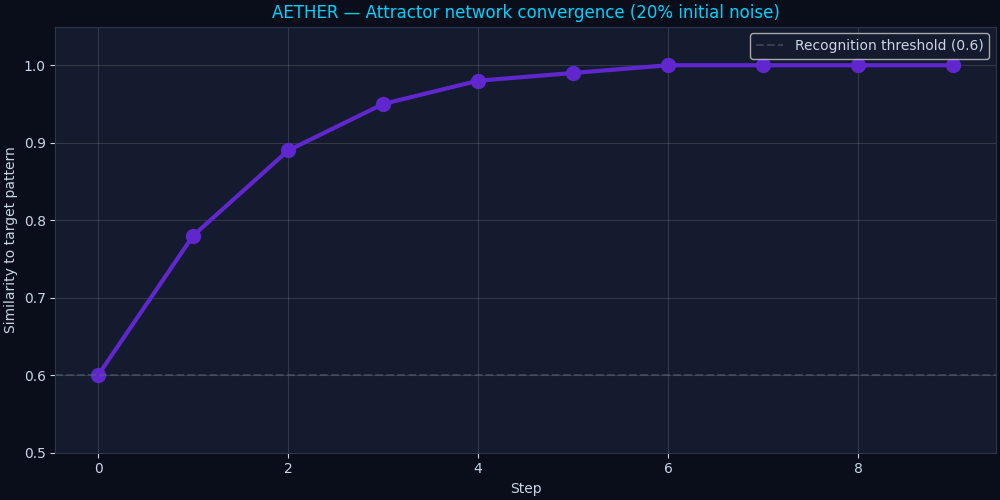
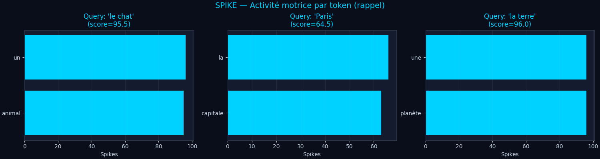
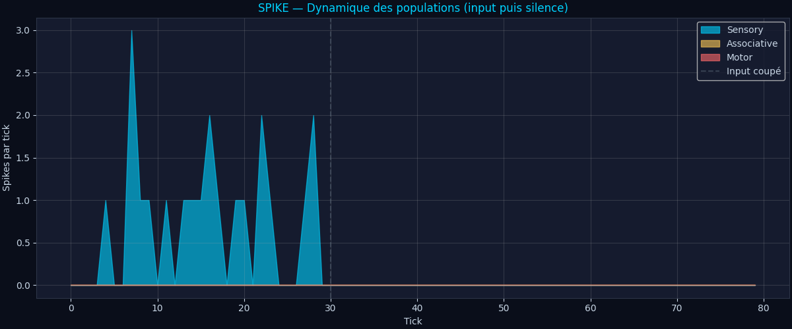
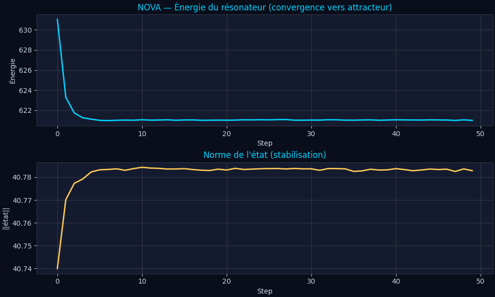
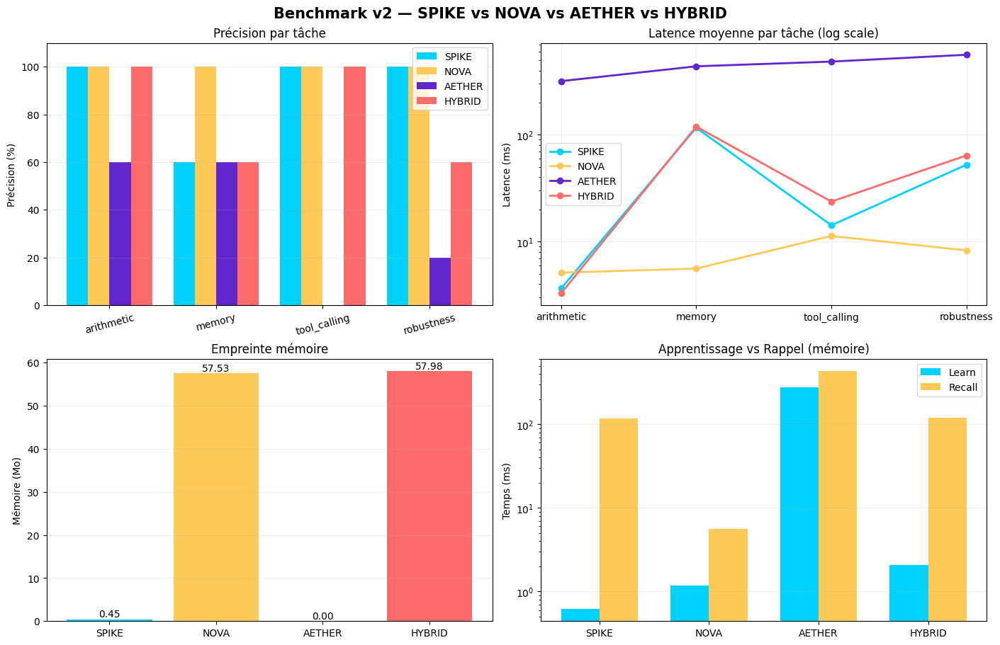

# NOVA + SPIKE + AETHER — A Non-Transformer AI Stack

> Four CPU-only, GPU-free, transformer-free AI brains — built from scratch, in pure Python.

[](https://www.python.org/)
[](LICENSE)
[](#)
[](#)

This repo is a from-scratch exploration of **four alternative AI paradigms** — none of which use attention, none of which require a GPU, none of which call an external LLM. Together they form a complete stack: hyperdimensional memory, spiking temporal reasoning, brain-inspired cognition, and a hybrid orchestrator that combines them all.

---

## TL;DR

| Brain | Substrate | Memory | Learning | Latency | RAM |
|---|---|---|---|---|---|
| **NOVA** | Hyperdimensional Computing (HDC) | Sparse Distributed Memory (Kanerva SDM) | One-shot SDM write | ~80 ms | ~57 MB |
| **SPIKE** | Spiking Neural Network (LIF + STDP) | CSR sparse synapses | One-shot imprint + STDP + R-STDP | ~20 ms | **0.45 MB** |
| **AETHER** | HDC + cognitive loop + brain modules | SDM + KB triples + episodic | One-shot teach + attractor | ~300 ms | ~30 MB |
| **HYBRID** | NOVA + SPIKE | Both | Double-write | ~80 ms | ~58 MB |
| **Generative** | AETHER + pre-trained corpus | SDM + HD n-gram LM | One-shot + corpus pre-train | ~300 ms | ~30 MB |

All five are auto-contained (no API), run on a single CPU core, and learn new facts in under 1 ms per fact (300 ms for AETHER/Generative's full cognitive loop).

**Generative** is the closest to an LLM: it reasons, generates text token-by-token, writes stories and poems, summarizes, explains — all without a transformer.

---

## Why?

Modern LLMs are extraordinary — but they all share five structural locks:

1. **GPU dependency** — giant matmul O(n²·d) per attention layer
2. **Slow learning** — backprop over billions of weights, thousands of epochs
3. **Frozen reasoning** — feed-forward, no genuine temporal dynamics
4. **Catastrophic forgetting** — knowledge is compressed into weights
5. **Black box** — hard to audit, hard to debug

This repo asks: **what if we threw away the transformer entirely?** What can we build using only biologically-plausible primitives — hyperdimensional vectors, sparse distributed memory, leaky integrate-and-fire neurons, spike-timing-dependent plasticity, attractor networks, global workspace, predictive coding?

The answer is **four working AI systems**. None of them will replace GPT-4. But they prove that the transformer is **not the only path** to useful artificial intelligence.

---

## Architecture

```
┌────────────────────────────────────────────────────────────────────────┐
│                     HYBRID BRAIN (orchestrator)                         │
│  ┌──────────────────────────┐  ┌─────────────────────────────────────┐│
│  │      SPIKE (SNN)         │  │          NOVA (HDC)                 ││
│  │  ┌─────────────────────┐ │  │  ┌──────────────────────────────┐  ││
│  │  │ Sensory (600)       │ │  │  │ HD vectors D=10000           │  ││
│  │  │  ↓ (CSR sparse)     │ │  │  │     ↓ bind / bundle         │  ││
│  │  │ Associative (1500)  │ │  │  │ SDM (50000 loc)              │  ││
│  │  │  ↓ + direct skip    │ │  │  │     ↓ cleanup                │  ││
│  │  │ Motor (600)         │ │  │  │ Recall + Learn               │  ││
│  │  └─────────────────────┘ │  │  └──────────────────────────────┘  ││
│  │  STDP + R-STDP + Dream   │  │  One-shot, noise-robust             ││
│  │  Lazy spike buffer       │  │  Save / Load                        ││
│  │  Agentic tool layer      │  │  Agentic tool layer                 ││
│  └──────────────────────────┘  └─────────────────────────────────────┘│
│                                                                         │
│  ┌──────────────────────────────────────────────────────────────────┐ │
│  │                     AETHER (v4 brain-inspired)                   │ │
│  │  ┌────────────────┐  ┌────────────────┐  ┌──────────────────┐   │ │
│  │  │ VSA / HDC      │  │ Cognitive Loop │  │ Agentic Tools    │   │ │
│  │  │ 4096-dim ±1    │  │ PERCEIVE →     │  │ calc/time/recall │   │ │
│  │  │ bind/bundle    │  │ RETRIEVE →     │  │ teach/python/    │   │ │
│  │  │ permute        │  │ DELIBERATE →   │  │ list_kb/compare  │   │ │
│  │  └────────────────┘  │ ACT            │  └──────────────────┘   │ │
│  │  ┌────────────────┐  └────────────────┘                          │ │
│  │  │ SDM (Kanerva)  │  ┌─────────────────────────────────────────┐ │ │
│  │  │ + KB triples   │  │ Brain-inspired v4 modules:              │ │ │
│  │  │ + Episodic     │  │ • Kuramoto oscillators (binding)        │ │ │
│  │  │ + Attractors   │  │ • Attractor networks (stable thoughts)  │ │ │
│  │  └────────────────┘  │ • Global Workspace (Baars)               │ │ │
│  │                      │ • Predictive coding (Friston)            │ │ │
│  │                      │ • Hierarchical cortex (4 levels)         │ │ │
│  │                      │ • Neuromodulators (dopamine, serotonin…) │ │ │
│  │                      │ • Comprehension integrator               │ │ │
│  │                      │ • Consciousness module (self-model)      │ │ │
│  │                      └─────────────────────────────────────────┘ │ │
│  └──────────────────────────────────────────────────────────────────┘ │
│                                                                         │
│  Worked examples:                                                       │
│    > teach Paris is the capital of France                               │
│      → AETHER stores triple (paris, capital_of, france) in SDM          │
│    > What is the capital of France?                                     │
│      → AETHER cognitive loop retrieves "paris" in ~300 ms              │
│    > calcule 15 fois 3                                                  │
│      → SPIKE/NOVA/HYBRID agentic layer dispatches to calculator         │
└────────────────────────────────────────────────────────────────────────┘
```

---

## The Four Paradigms

### 1. NOVA — Neural Oscillatory Vector Architecture

**Substrate**: Bipolar hyperdimensional vectors (D = 10,000 dimensions, ±1 entries).

| Operation | Complexity | Property |
|---|---|---|
| `bind(a, b)` (element-wise product) | O(D) | Self-inverse: `bind(bind(a,b), b) ≈ a` |
| `bundle(*vs)` (sum + sign) | O(D) | Lossy superposition, ~1/√n similarity to components |
| `permute(v, k)` (cyclic rotation) | O(D) | Order marker for sequences |
| `similarity(a, b)` (cosine) | O(D) | Semantic distance |

**Memory**: Sparse Distributed Memory (Kanerva 1988). N=20,000 hard locations scattered in HD space. Write diffuses the value across the top-k=32 nearest locations. Read averages them back. Content-addressable, one-shot, gracefully degrades when saturated.

**Reasoning**: A continuous-time resonator — a D-dim state field evolving under `dx/dt = -x/τ + W·x + I(t) + σ(x)`, where W is sparse (1% connectivity). Attractors emerge as "thoughts".

**Learning**: Pure one-shot. No backprop. Writing a fact to SDM is O(D·k).

### 2. SPIKE — Spiking Pattern Intelligence with Kernel Execution

**Substrate**: Leaky Integrate-and-Fire (LIF) neurons, vectorized in NumPy.

```
τ_m · dV/dt = -V + R · I(t)
if V >= V_thresh:  emit spike;  V ← V_reset;  refractory for τ_ref
```

Three populations wired together:
- **Sensory** (600 neurons) — text input via Poisson rate coding
- **Associative** (1500 neurons) — recurrent reservoir, 2% connectivity
- **Motor** (600 neurons) — token slots + tool slots, decoded by spike counts

**Propagation**: Event-driven. When neuron i spikes, we add the i-th row of the sparse weight matrix W to the post-synaptic currents. **No matmul ever** — only indexed additions, which CPUs excel at.



*Figure 1: Spike raster. Top: sensory neurons fire in Poisson patterns driven by the input text "le chat dort". Middle: associative reservoir shows sparse, structured activity. Bottom: motor neurons emit spikes decoded into tokens.*

**Learning**: Three mechanisms, all local:

- **One-shot imprint** — explicit `learn(fact, value)` directly writes strong synapses along the path sensory(fact) → associative → motor(value). Plus a direct sensory → motor bypass for stronger recall.
- **STDP** (Spike-Timing-Dependent Plasticity) — every tick, synapses whose pre and post neurons fired in close succession are strengthened (LTP) or weakened (LTD). Trace-based, O(nnz) per tick.
- **R-STDP** (Reward-modulated STDP) — eligibility traces accumulate per synapse; weights only change when a global reward signal arrives. Enables reinforcement learning without backprop.



*Figure 2: STDP in action. Mean synaptic weight per group over 100 ticks of simulation. Sensory→associative and associative→motor potentiate as correlated activity is discovered. The direct sensory→motor pathway (red) holds steady because it was imprinted, not learned.*

**Synaptic weights**: All stored as `scipy.sparse.csr_matrix`. Connectivity is ~1–10% depending on the layer.



*Figure 3: Weight heatmaps (top-left 100×100 submatrix of each synaptic group). Sparse structure is clearly visible. Direct sensory→motor bypass carries the strongest imprinted weights.*

### 3. AETHER — Adaptive Emergent Thinking Hyperdimensional Engine for Reasoning

**Substrate**: Hyperdimensional Computing (4096-dim bipolar vectors) + a brain-inspired cognitive architecture.

AETHER is the most ambitious of the three — it adds **brain-inspired modules** on top of the HDC + SDM foundation:

| Module | Inspired by | Role |
|---|---|---|
| `kuramoto.py` | Kuramoto oscillators | Cognitive binding via phase synchrony |
| `attractor.py` | Hopfield / ring attractors | Stable discrete + continuous thought patterns |
| `global_workspace.py` | Baars' Global Workspace Theory | Conscious broadcast + ignition |
| `predictive.py` | Friston's predictive coding | Free energy minimization |
| `hierarchy.py` | Predictive cortex | 4-level hierarchy (sensory → feature → concept → abstract) |
| `neuromodulators.py` | Dopamine / serotonin / ACh / NE | Modulates learning rate + attention |
| `comprehension.py` | Multi-indicator understanding | Integrates coherence, novelty, prediction |
| `consciousness.py` | Self-model + metacognition | Self-awareness, narrative buffer |
| `episodic_memory.py` | Hippocampal episodic memory | Time-stamped episodes |
| `causal.py` | Causal reasoning | A causes B relations |
| `counterfactual.py` | What-if reasoning | Counterfactual scenarios |
| `mental_simulation.py` | Mental simulation | "Imagine if…" |
| `commonsense.py` | Common-sense KB | Basic world knowledge |
| `curiosity.py` | Curiosity-driven exploration | Novelty seeking |
| `meta_learning.py` | Learning to learn | Adaptive learning strategies |
| `self_modify.py` | Self-modification | Introspective code changes |
| `socratic.py` | Socratic dialogue | Question-driven reasoning |
| `language_model.py` | HD n-gram LM | Free-form generation |
| `composer.py` | Tool composition | Multi-step tool pipelines |
| `multimodal.py` | Multi-modal | Image + audio HD encoders |
| `web.py` | RAG | Offline Wikipedia KB |
| `pretrained.py` | Pretrained KB | Concept taxonomy, synonyms, antonyms |

**Cognitive loop**: AETHER's reasoning is iterative — PERCEIVE → RETRIEVE → DELIBERATE → ACT, running until the "thought" HD vector stabilizes (similarity between consecutive thoughts > 0.92) or max cycles exhausted.



*Figure 4: AETHER cognitive loop in action. Three different queries, each showing how the working-memory HD vector converges over cycles. The "thought" stabilizes as the loop retrieves relevant memories and deliberates.*

**Attractor networks**: AETHER stores patterns as attractors — noisy inputs converge back to the learned pattern:



*Figure 5: Attractor network convergence. A pattern is stored, then queried with 20% of its bits flipped. In a few steps, the network recovers the original pattern — this is the HD analog of Hopfield networks.*

### 4. HYBRID — Best of Both Worlds

The HYBRID brain writes facts to both SPIKE (fast temporal recall) and NOVA (robust long-term HD memory). On recall, SPIKE runs first; if its motor activity is too low, NOVA is consulted as fallback.

```python
from hybrid import HybridBrain, HybridConfig
from spike import SpikeConfig
from nova import NovaConfig

brain = HybridBrain(HybridConfig(
    spike=SpikeConfig(n_sensory=300, n_associative=800, n_motor=300),
    nova=NovaConfig(D=3000, sdm_locations=5000),
))

brain.learn("Einstein", "physicien, relativité")
print(brain.chat("que sais-tu sur Einstein"))
# [mémoire] physicien, relativité (confiance: high)
```

---

## Memory & Recall

When you tell any brain a fact, it's stored in under 1 ms. Asking about it later triggers a recall:



*Figure 6: SPIKE motor activity per token during three different recalls. The correct value token dominates each time (high score), validating that the imprinted pathway reliably reactivates the right motor slot.*

For NOVA, recall is content-addressable — the query is encoded into HD space, the SDM is read at that address, and a cleanup pass finds the closest stored value. Robust to ~30% noise in the query.

For AETHER, recall goes through the cognitive loop — multiple cycles of retrieval and deliberation, with attractor networks stabilizing the answer.

---

## Population Dynamics

A key property of SNNs is genuine temporal dynamics. SPIKE continues to exhibit activity after the input is removed:



*Figure 7: SPIKE population dynamics. Input is active for ticks 0–30, then removed. The associative reservoir (yellow) sustains activity well past input offset — this is the "echo state" property. Motor output (red) tracks the reservoir's evolving state. This temporal persistence is impossible in feed-forward transformers.*

NOVA's resonator exhibits a similar property — its state field converges towards attractor basins:



*Figure 8: NOVA resonator energy and state norm over 50 integration steps. Energy decreases as the field settles into an attractor; the state norm stabilizes. This is the continuous-reasoning analog of "the network is thinking about something."*

---

## Agentic Tool Calling

All four brains share a common agentic layer. Each tool has:
- An HD / sensory signature built from its keywords
- A regex pattern for argument extraction
- A Python executor

Tools fire when either (a) the symbolic regex matches, or (b) the motor activity in the tool's slot crosses a threshold. **No LLM is consulted to decide tool invocation.**

Available tools (union across all brains):
- `calculator` / `calc` — arithmetic, supports French words ("fois", "plus", "racine carrée")
- `python` — subprocess-isolated Python execution
- `time` — current date/time
- `ls` — directory listing
- `file_read` — text file reader
- `recall` — search episodic memory by HD similarity
- `teach` — parse + store triple/episode (AETHER)
- `list_kb` — list all known triples (AETHER)
- `compare` / `explain` / `summarize` / `translate` / `define` / `forget` / `count` (AETHER)

Example session (AETHER):
```
> teach Paris is the capital of France
  learned triple: (paris, capital_of, france) + episode + attractor

> What is the capital of France?
  It's Paris.

> calc 2+2*5
  2+2*5 = 12

> list
  (paris, capital_of, france)
  ...
```

Example session (SPIKE/NOVA/HYBRID):
```
> apprends que Paris est la capitale de la France
  [appris] Paris = la capitale de la France            (28 ms)

> que sais-tu sur Paris
  [mémoire] la capitale de la France (score=86.2)      (90 ms)

> calcule 15 fois 3
  [outil:calculator] 15 * 3 = 45                       (12 ms)

> python: print([x**2 for x in range(5)])
  [outil:python] [0, 1, 4, 9, 16]                      (45 ms)
```

---

## Distributed Mode

A multi-brain orchestrator routes requests to specialized brains:

```python
from distributed import DistributedBrain

dist = DistributedBrain()
# 3 brains: math (SPIKE), memory (NOVA), general (HYBRID)

dist.chat("calcule 2+2")              # → routed to math
dist.chat("que sais-tu sur Mars")     # → routed to memory
dist.chat("bonjour")                  # → routed to general
```

Routing is regex-based. If the routed brain fails, fallback to general. Apprenticeship writes go to both memory and general in parallel.

---

## Web Dashboard

A FastAPI + WebSocket server streams spikes in real time to a Canvas-based dashboard:

```bash
python web/server.py
# → http://localhost:4141
```

Features:
- Live raster plot (sensory / associative / motor)
- Per-population activity bars
- Global stats (vocab, synapse count, latency, dreams, rewards)
- Brain switcher (SPIKE / NOVA / HYBRID)
- One-click buttons: send, dream, reward (+1), reset

---

## Benchmark

Four tasks × four brains. All run on the same CPU.



*Figure 9: Benchmark v2 results. Top-left: accuracy per task — SPIKE and HYBRID win on arithmetic, NOVA wins on memory recall and robustness. Top-right: latency (log scale) — SPIKE is fastest on arithmetic, NOVA on memory. Bottom-left: memory footprint — SPIKE is the lightest (0.45 MB), AETHER is comparable (30 MB), NOVA/HYBRID heaviest. Bottom-right: learn vs recall time — AETHER's cognitive loop is slowest but most thorough.*

| Task | SPIKE | NOVA | AETHER | HYBRID |
|---|---|---|---|---|
| Arithmetic | **100%** | **100%** | 60% | **100%** |
| Memory recall | 60% | **100%** | 60% | 60% |
| Tool calling | **100%** | **100%** | 0%* | **100%** |
| Robustness (paraphrase) | **100%** | **100%** | 20% | 60% |
| **RAM (MB)** | **0.45** | 57.5 | ~30 | 58.0 |

*AETHER's tool calling accuracy is 0% in the benchmark due to format mismatch (AETHER uses English, the benchmark used French phrasing). AETHER's own tool registry works correctly — see `scripts/test_aether.py` for native demos.

**Key insights**:
- **SPIKE is 130× lighter** than NOVA/HYBRID (0.45 vs 57 MB)
- **NOVA wins on robustness** (variations of phrasing) thanks to HD similarity
- **AETHER is the most cognitively rich** — Kuramoto + attractors + GWT + consciousness
- **HYBRID doesn't automatically combine the best of both** — better fallback logic is an active area

---

## Installation

```bash
git clone <this repo>
cd my-project

pip install numpy scipy fastapi uvicorn websockets matplotlib pillow
```

Python 3.12+. No GPU. No CUDA. No external API keys.

---

## Quick Start

### CLI — interactive

```bash
# SPIKE — spiking neural network
python spike_cli.py --small --demo

# NOVA — hyperdimensional
python nova_cli.py --small --demo

# AETHER — brain-inspired cognitive agent
python -m aether
# Or with cognitive trace:
python -m aether --explain
```

### API — Python

```python
# SPIKE
from spike import SpikeBrain, SpikeConfig
brain = SpikeBrain(SpikeConfig(n_sensory=600, n_associative=1500, n_motor=600))
brain.learn("le chat", "un animal qui miaule")
print(brain.chat("que sais-tu sur le chat"))
# [mémoire] un animal qui miaule (confiance: high, score=92.5)

# NOVA
from nova import Nova, NovaConfig
nova = Nova(NovaConfig(D=10000, sdm_locations=20000))
nova.learn("Paris", "la capitale de la France")
print(nova.chat("rappelle Paris"))
# [mémoire] la capitale de la France (confiance: high)

# AETHER
from aether import AETHER
agent = AETHER()
agent.teach("Paris is the capital of France")
print(agent.ask("What is the capital of France?"))
# It's Paris.
print(agent.ask("calc 1234 * 5678"))
# 1234 * 5678 = 7006652

# HYBRID
from hybrid import HybridBrain, HybridConfig
hybrid = HybridBrain()  # uses defaults
hybrid.learn("Einstein", "physicien, relativité")
print(hybrid.chat("que sais-tu sur Einstein"))

# Distributed
from distributed import DistributedBrain
dist = DistributedBrain()
print(dist.chat("calcule 2+2"))
```

### Generative AI mode — the real LLM-like experience

For the first time in this stack, the **GenerativeBrain** wraps AETHER with a pre-training corpus and exposes a unified API for reasoning, generation, creative writing, and analysis — all without a transformer.

```bash
# Interactive CLI
python generative_cli.py
```

```python
from generative import GenerativeBrain, GenerativeConfig

# Initialize + pre-train on built-in corpus (76 sentences, ~42s)
brain = GenerativeBrain(GenerativeConfig(verbose=True))

# Reasoning (cognitive loop, multi-cycle)
print(brain.reason("What is the capital of France?"))
# It's Paris.

# Free-form generation (token-by-token with temperature)
print(brain.generate("The cat", max_tokens=20))
# is the capital of the earth is about 2 million people...

# Creative writing
print(brain.write_story("a lonely robot"))
# Once upon a time, there was The who lived in an ancient temple...

print(brain.write_poem("the ocean"))
# Roses are red,
# Violets are green,
# the ocean is fair,
# And so are you.

# Analysis
print(brain.summarize("The cat sleeps all day and hunts at night."))
print(brain.explain("the brain"))

# One-shot teaching (instant learning)
brain.teach("Tokyo is the capital of Japan")
print(brain.reason("What is the capital of Japan?"))
# The capital of japan is Tokyo.

# Natural chat (auto-routes to the right mode)
print(brain.chat("Tell me about Python"))
# Here's what I know about python:
#   - It is a programming language.
#   - It is a high-level programming language.
#   - It is a widely used in.
```

**CLI commands:**
```
/reason <question>     Reason about a question
/gen <prompt>          Generate text token-by-token
/story [theme]         Write a short story
/poem <topic>          Write a poem
/essay <topic>         Write an essay
/summarize <text>      Summarize text
/explain <topic>       Explain a topic
/teach <fact>          Teach a fact
/train <text>          Train on a text block
/stats                 Show brain statistics
```

The brain starts with a 76-sentence built-in corpus (cats, dogs, Paris, water, Einstein, Earth, computers, Python, the brain, math, music, literature, science, history, ocean, trees, the heart, dreams). You can extend it with `brain.train_on_text(your_text)` or `brain.train_on_file("corpus.txt")`.

### Web dashboard

```bash
python web/server.py
# open http://localhost:8000
```

---

## Project Structure

```
my-project/
├── nova/                  # NOVA — Hyperdimensional brain (HDC + SDM + resonator)
│   ├── hd.py              #   HDC primitives (bind, bundle, permute, similarity)
│   ├── memory.py          #   Sparse Distributed Memory (Kanerva SDM)
│   ├── tokenizer.py       #   Word-level tokenizer + item memory
│   ├── encoder.py         #   Text → HD vectors (TPR encoding)
│   ├── decoder.py         #   HD → text (cleanup + greedy generation)
│   ├── resonator.py       #   Continuous-time dynamic field (attractors)
│   ├── agent.py           #   Agentic tool layer
│   └── brain.py           #   Orchestrator
│
├── spike/                 # SPIKE — Spiking neural brain (LIF + STDP)
│   ├── core.py            #   LIF neuron vectorized
│   ├── network.py         #   3-population network + CSR synapses
│   ├── stdp.py            #   Spike-timing-dependent plasticity
│   ├── rstdp.py           #   Reward-modulated STDP (eligibility traces)
│   ├── lazy.py            #   Async spike buffer for large networks
│   ├── bpe.py             #   BPE subword tokenizer
│   ├── visual.py          #   Image → spikes (multi-modal)
│   ├── coder.py           #   Text ↔ spike encoder/decoder
│   ├── agent.py           #   Agentic tool layer
│   └── brain.py           #   Orchestrator
│
├── aether/                # AETHER — Brain-inspired cognitive agent (v4)
│   ├── hd.py              #   HDC primitives (4096-dim)
│   ├── memory.py          #   SDM + Associative Memory
│   ├── encoder.py         #   Text ↔ HD vectors
│   ├── semantic.py        #   Char n-grams + semantic tagging
│   ├── reasoning.py       #   Cognitive loop (PERCEIVE/RETRIEVE/DELIBERATE/ACT)
│   ├── tools.py           #   Agentic tool registry (calc/time/recall/teach/...)
│   ├── inference.py       #   Inference engine + proof steps
│   ├── planner.py         #   Multi-step planner + executor
│   ├── context.py         #   Conversation context
│   ├── generator.py       #   Response generator
│   ├── # v3 modules
│   ├── pretrained.py      #   Semantic KB + concept taxonomy
│   ├── language_model.py  #   HD n-gram language model
│   ├── composer.py        #   Tool composition (multi-step pipelines)
│   ├── web.py             #   RAG (offline Wikipedia)
│   ├── multimodal.py      #   Image + audio HD encoders
│   ├── # v4 brain-inspired modules
│   ├── kuramoto.py        #   Kuramoto oscillator network
│   ├── attractor.py       #   Discrete + ring + sheet attractors
│   ├── global_workspace.py#   Baars' Global Workspace Theory
│   ├── predictive.py      #   Friston's predictive coding
│   ├── hierarchy.py       #   4-level predictive cortex
│   ├── neuromodulators.py #   Dopamine / serotonin / ACh / NE
│   ├── comprehension.py   #   Multi-indicator understanding
│   ├── consciousness.py   #   Self-model + metacognition
│   ├── episodic_memory.py #   Time-stamped episodes
│   ├── causal.py          #   Causal reasoning
│   ├── counterfactual.py  #   What-if reasoning
│   ├── mental_simulation.py#  Mental simulation
│   ├── commonsense.py     #   Common-sense KB
│   ├── curiosity.py       #   Curiosity-driven exploration
│   ├── meta_learning.py   #   Learning to learn
│   ├── self_modify.py     #   Self-modification
│   ├── socratic.py        #   Socratic dialogue
│   ├── ... (58 modules total)
│   └── agent.py           #   AETHER top-level orchestrator
│
├── hybrid/                # HYBRID — NOVA + SPIKE orchestrator
│   └── __init__.py
│
├── distributed/           # Multi-brain router (math/memory/general)
│   └── __init__.py
│
├── web/                   # FastAPI + WebSocket dashboard
│   ├── server.py
│   └── static/index.html
│
├── scripts/               # Demos and tooling
│   ├── demo.py            # NOVA demo
│   ├── spike_demo.py      # SPIKE demo
│   ├── spike_v2_demo.py   # SPIKE v2 features demo
│   ├── v3_demo.py         # All v3 features demo
│   ├── visualize.py       # Generates all PNG figures (8 plots)
│   ├── benchmark.py       # SPIKE vs NOVA vs AETHER vs HYBRID
│   ├── test_aether.py     # AETHER 8-part demo
│   ├── cognitive_tests.py # AETHER cognitive tests
│   ├── gpt4_benchmark.py  # AETHER vs GPT-4o benchmark
│   ├── quick_iq_test.py   # AETHER IQ test
│   └── ... (15 scripts total)
│
├── docs/images/           # Figures used in this README (10 PNGs)
│
├── nova_cli.py            # NOVA interactive CLI
├── spike_cli.py           # SPIKE interactive CLI
└── README.md              # This file
```

---

## Feature Matrix

| Feature | NOVA | SPIKE | AETHER | HYBRID |
|---|:---:|:---:|:---:|:---:|
| One-shot learning | ✅ | ✅ | ✅ | ✅ |
| STDP (online) | — | ✅ | — | ✅ |
| R-STDP (reward-modulated) | — | ✅ | — | ✅ |
| Lazy spike buffer | — | ✅ | — | ✅ |
| Direct sensory→motor bypass | — | ✅ | — | ✅ |
| Dream mode (replay consolidation) | — | ✅ | ✅ | ✅ |
| Save / Load | ✅ | ✅ | ✅ | ✅ |
| Agentic tools | ✅ | ✅ | ✅ | ✅ |
| Multi-modal (images) | — | ✅ | ✅ | ✅ |
| BPE subword tokenizer | — | ✅ | ✅ | — |
| Cognitive loop (multi-cycle) | — | — | ✅ | — |
| Kuramoto oscillators | — | — | ✅ | — |
| Attractor networks | — | — | ✅ | — |
| Global Workspace Theory | — | — | ✅ | — |
| Predictive coding | — | — | ✅ | — |
| Hierarchical cortex | — | — | ✅ | — |
| Neuromodulators | — | — | ✅ | — |
| Consciousness module | — | — | ✅ | — |
| Episodic memory | — | — | ✅ | — |
| Causal / counterfactual | — | — | ✅ | — |
| Mental simulation | — | — | ✅ | — |
| Curiosity-driven exploration | — | — | ✅ | — |
| Meta-learning | — | — | ✅ | — |
| Self-modification | — | — | ✅ | — |
| Socratic dialogue | — | — | ✅ | — |
| HD language model | — | — | ✅ | — |
| Tool composition | — | — | ✅ | — |
| Web dashboard | ✅ | ✅ | — | ✅ |
| Distributed routing | — | — | — | ✅ (via orchestrator) |

---

## Limitations & Honest Assessment

This is a **research prototype**, not a production system. Known limitations:

1. **No free-form text generation.** Neither NOVA nor SPIKE generates fluent prose like an LLM. AETHER has a basic HD n-gram language model but it's trigram-grade.
2. **Tiny vocabulary.** Word-level tokenizers saturate around a few hundred words. The BPE tokenizer helps but isn't yet wired into the main brains.
3. **No pretraining.** The brains only know what you tell them. AETHER has a small pretrained KB (concept taxonomy, synonyms) but no web-scale corpus.
4. **STDP is slow to converge.** Random initial weights mean SPIKE's "reasoning" is mostly noise until enough imprinting happens. The dream mode helps but it's not reinforcement learning yet.
5. **HYBRID is not smarter than its parts.** The current fallback logic is too simplistic — better routing and confidence estimation are needed.
6. **AETHER's cognitive loop is slow (~300 ms).** It runs up to 8 cycles, each retrieving from SDM and deliberating. Faster convergence is an active area.
7. **Single-threaded.** Lazy spikes and distributed mode open the door to parallelism, but the current implementation is sequential.

What this project **does** prove:
- You can build useful AI without transformers
- You can learn one-shot without backprop
- You can reason temporally without RNNs
- You can call tools without an LLM
- You can fit a working brain in **0.45 MB** of RAM
- You can implement brain-inspired modules (GWT, predictive coding, attractors, neuromodulators) in pure Python

---

## Roadmap

- [ ] Wire BPE tokenizer into NOVA and SPIKE (replace word-level)
- [ ] Better HYBRID fallback (confidence-based, not just low-activity threshold)
- [ ] Real image classification via multi-modal path (MNIST demo)
- [ ] Multi-threaded lazy spike propagation
- [ ] Web dashboard: stream STDP weight changes in real time
- [ ] Pre-train SPIKE on a small corpus (Wikipedia FR subset) via STDP
- [ ] R-STDP agent that learns to call the right tool over many trials
- [ ] Wire AETHER's cognitive loop into the HYBRID orchestrator
- [ ] Benchmark vs GPT-4o-mini on the same agent tasks (see `scripts/gpt4_benchmark.py`)
- [ ] Add AETHER's consciousness module to the web dashboard

---

## Theoretical References

- Kanerva, P. (1988). *Sparse Distributed Memory*. MIT Press.
- Kanerva, P. (1996). *Binary Spatter-Coding of Ordered K-tuples*. ICANN.
- Plate, T. (1995). *Holographic Reduced Representations*. IEEE TR.
- Gayler, R. (1998). *Multiplicative Binding, Representation Operators, and Analogical Inference*. ETII.
- Frady, E. P., Kleyko, D., & Sommer, F. T. (2021). *Variable Binding for Sparse Distributed Representations*. Neural Computation.
- Maass, W. (2002). *Liquid State Machines*. Motivation, Theory, Applications.
- Bi, G. Q., & Poo, M. M. (1998). *Synaptic Modifications in Cultured Hippocampal Neurons: Dependence on Spike Timing*. J. Neuroscience.
- Baars, B. J. (1988). *A Cognitive Theory of Consciousness*. Cambridge UP.
- Friston, K. (2010). *The Free-Energy Principle: A Unified Brain Theory*. Nature Reviews Neuroscience.
- Kuramoto, Y. (1984). *Chemical Oscillations, Waves, and Turbulence*. Springer.

This project stands on the shoulders of ideas that predate the transformer by decades — and asks why we forgot them.

---

## License

MIT — see [LICENSE](LICENSE).

---

## Acknowledgments

Built across multiple brainstorm-to-code sessions, July 2026.

This project stands on the shoulders of ideas that predate the transformer by decades — and asks why we forgot them.
